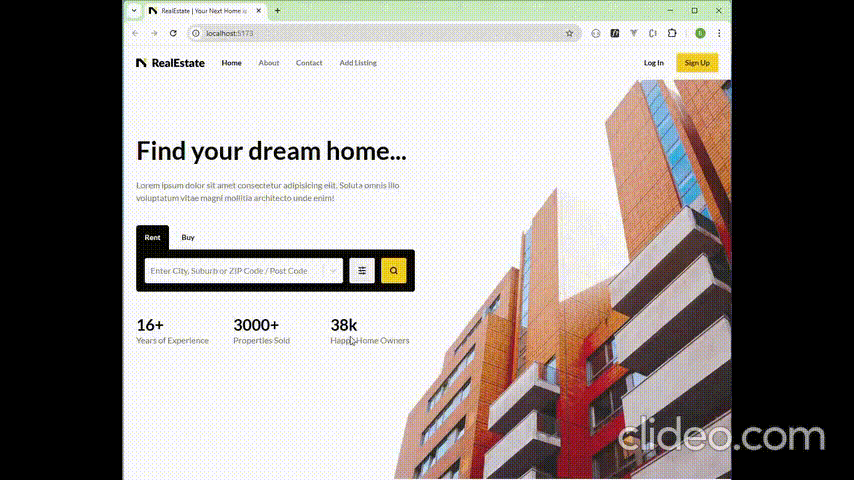

Here is a **very brief README.md** including the **`screenshot.gif`** from the project root:

---

# MERN Real Estate

A simple real-estate listing platform built using the **MERN stack (MongoDB, Express, React, Node.js)**.



## Features

- User authentication (register / login)
- Add, edit, delete property listings
- Browse and view property details
- Search & filter listings
- Fully responsive React frontend
- REST API with Express + MongoDB

## Tech Stack

- **Frontend:** React
- **Backend:** Node.js + Express
- **Database:** MongoDB
- **Auth:** JWT

## Quick Start

```bash
# clone repo
git clone https://github.com/bimendra/mern-real-estate.git
cd mern-real-estate

# install backend
cd backend
npm install
npm run dev

# install frontend
cd ../frontend
npm install
npm start
```

## Environment Variables

Backend requires:

```
MONGO_URI=
JWT_SECRET=
```
